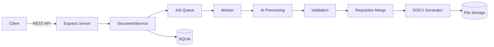

# DocxGen — Документ за 3 шага

AI-powered backend that turns Russian text drafts into formatted DOCX documents.

## What It Does

DocxGen takes a rough draft in Russian and transforms it into a properly formatted, editable DOCX file. The AI handles spelling, grammar, and style corrections while extracting key document requisites (addressee, author, date, etc.).

**Workflow:**
1. User sends a draft (plain text)
2. AI corrects spelling, grammar, and style
3. AI extracts document requisites (addressee, author, etc.)
4. System validates extracted data against the original draft
5. DOCX is generated from a configurable template
6. User downloads the final document

**Supported clients:** Web, MAX-bot, VK-bot

## Quick Start

### Prerequisites

- Node.js 24+
- pnpm
- (Optional) Ollama for local AI processing

### Run Locally

```bash
pnpm install
cp .env.example .env
pnpm dev
```

Server starts at http://localhost:3000

### Run with Docker (Optional)

```bash
docker compose up
```

## Architecture



**Key components:**
- **Express Server** — REST API + bot adapters
- **DocumentService** — Single point of entry for all operations
- **Job Queue** — SQLite-backed, idempotent processing
- **AI Module** — OpenAI-compatible provider (Ollama, vLLM, etc.)
- **Validation** — Grounding checks + fact comparison
- **DOCX Generator** — Programmatic document creation using `docx` library
- **File Storage** — Local filesystem with caching

## API

Brief overview. For full reference, see [docs/api.md](docs/api.md).

### Core Endpoints

| Method | Path | Description |
|--------|------|-------------|
| POST | /api/documents | Create a document |
| POST | /api/documents/:id/process | Run AI processing |
| POST | /api/documents/:id/render | Generate DOCX |
| GET | /api/files/:fileId | Download the file |
| GET | /api/documents/:id | Get document status |
| PUT | /api/documents/:id/fields | Set field values |

### Full API Reference

→ [docs/api.md](docs/api.md)

## Integration Examples

For practical integration examples (curl, JavaScript, Python), see:

→ [docs/integration-guide.md](docs/integration-guide.md)

## Configuration

Key environment variables:

| Variable | Description | Default |
|----------|-------------|---------|
| `PORT` | Server port | 3000 |
| `DATA_DIR` | Data storage directory | ./data |
| `AI_PROVIDER` | AI provider type | openai-compat |
| `AI_BASE_URL` | AI API endpoint | http://localhost:11434/v1 |
| `AI_MODEL` | AI model name | qwen2.5:7b-instruct |
| `AI_TEMPERATURE` | AI temperature | 0.1 |
| `AI_TIMEOUT_MS` | AI request timeout | 90000 |
| `AI_FAULT` | Simulate AI failures | off |
| `MAX_ENABLED` | Enable MAX bot | 0 |
| `VK_ENABLED` | Enable VK bot | 0 |
| `CLEANUP_ENABLED` | Enable automatic cleanup | 1 |

Full list: see [.env.example](.env.example)

## Document Types

| Type | Description |
|------|-------------|
| memo | Служебная записка (internal memo) |
| report | Докладная записка (report memo) |
| reference | Информационная справка (informational reference) |
| letter | Письмо (letter) |

## Templates

| Template | Style |
|----------|-------|
| classic | Times New Roman 14pt, traditional corporate layout |
| modern | Arial 12pt, contemporary regulatory layout |

## Development

```bash
pnpm test          # Run tests
pnpm run eval      # Evaluate AI quality
pnpm typecheck     # Type checking
pnpm build         # Build project
```

## Documentation

- [API Reference](docs/api.md) — Full REST API documentation
- [Integration Guide](docs/integration-guide.md) — Practical examples for web, bot, and third-party integrations
- [Architecture](plan-backend.md) — Detailed backend architecture and design decisions

## License

[Your License]